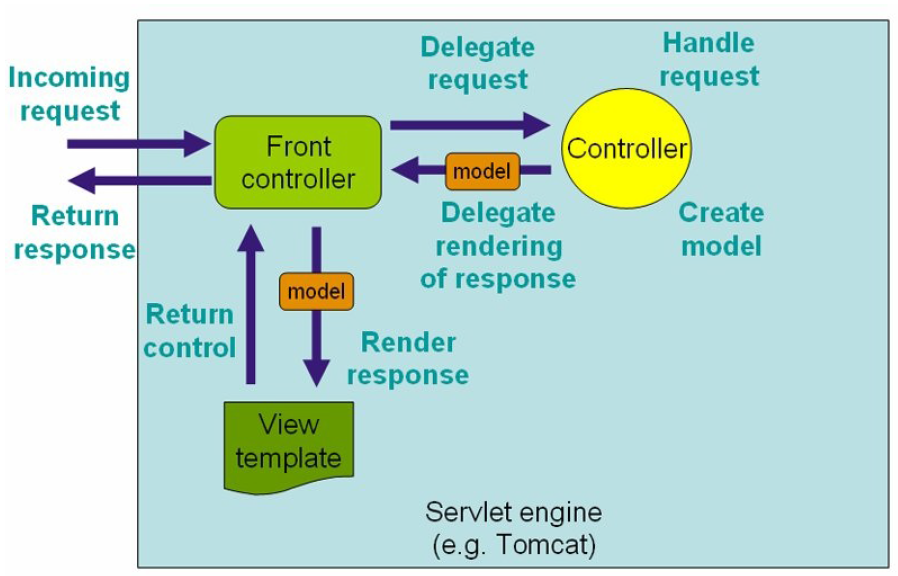
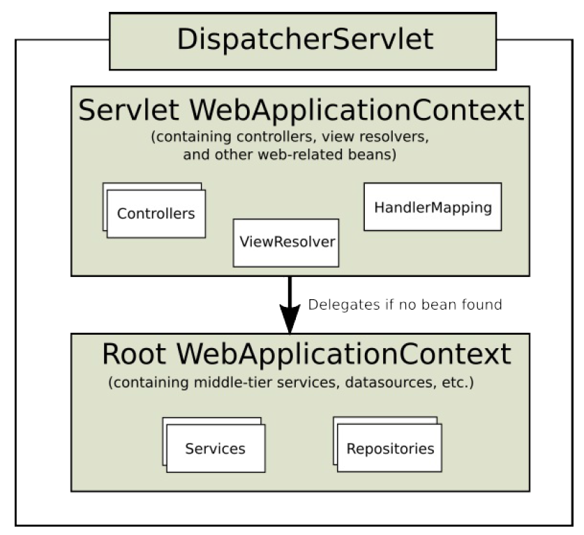
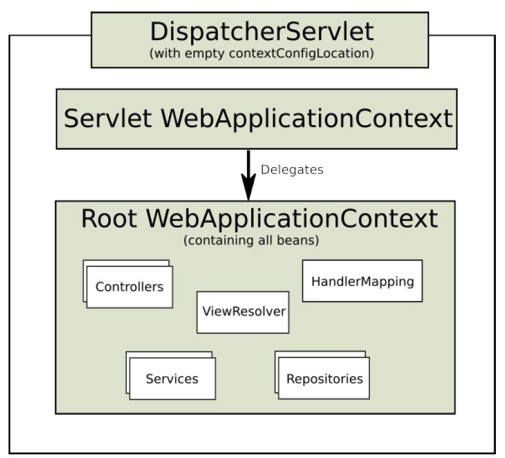
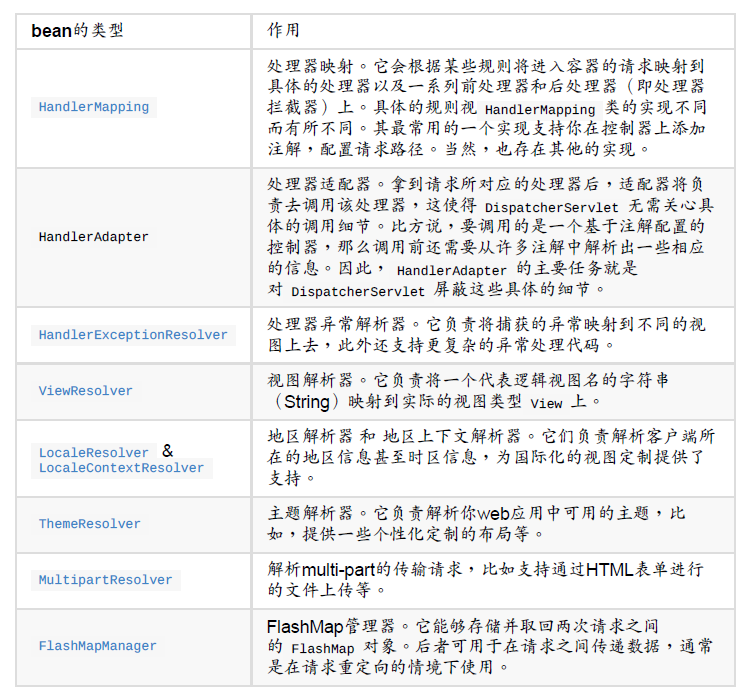
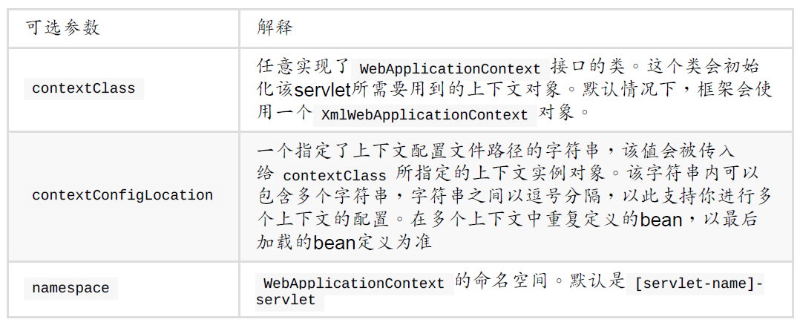

# 1、Spring Web MVC框架简介

Spring的模型-视图-控制器（MVC）框架是围绕一个 DispatcherServlet 来设计的，这个Servlet会把请求分发给各个处理器，并支持可配置的处理器映射、视图渲染、本地化、时区与主题渲染等，甚至还能支持文件上传。处理器是你的应用中注解了 @Controller 和 @RequestMapping 的类和方法，Spring为处理器方法提供了极其多样灵活的配置。Spring 3.0以后提供了 @Controller 注解机制、@PathVariable 注解以及一些其他的特性，你可以使用它们来进行RESTful web站点和应用的开发。

Spring的视图解析也是设计得异常灵活。控制器一般负责准备一个 Map 模型、填充数据、返回一个合适的视图名等，同时它也可以直接将数据写到响应流中。视图名的解析高度灵活，支持多种配置，包括通过文件扩展名、 Accept 内容头、bean、配置文件等的配置，甚至你还可以自己实现一个视图解析器 ViewResolver 。模型（MVC中的M，model）其实是一个 Map类型的接口，彻底地把数据从视图技术中抽象分离了出来。你可以与基于模板的渲染技术直接整合，如JSP、Velocity和Freemarker等，或者你还可以直接生成XML、JSON、Atom以及其他多种类型的内容。 Map 模型会简单地被转换成合适的格式，比如JSP的请求属性（attribute），一个Velocity模板的模型等。

# 2、DispatcherServlet

Spring MVC框架，与其他很多web的MVC框架一样：请求驱动；所有设计都围绕着一个中央Servlet来展开，它负责把所有请求分发到控制器；同时提供其他web应用开发所需要的功能。不过Spring的中央处理器，DispatcherServlet，能做的比这更多。它与Spring IoC容器做到了无缝集成，这意味着，Spring提供的任何特性，在Spring MVC中你都可以使用。

下图展示了Spring Web MVC的 DispatcherServlet 处理请求的工作流。



DispatcherServlet 其实就是个 Servlet （它继承自 HttpServlet 基类），同样也需要在你web应用的 web.xml 配置文件下声明。你需要在 web.xml 文件中把你希望DispatcherServlet 处理的请求映射到对应的URL上去。

Spring中的 ApplicationContext 实例是可以有范围（scope）的。在Spring MVC中，每个 DispatcherServlet 都持有一个自己的上下文对象 WebApplicationContext ，它又继承了根（root） WebApplicationContext 对象中已经定义的所有bean。这些继承的bean可以在具体的Servlet实例中被重载，在每个Servlet实例中你也可以定义其scope下的新bean。



DispatcherServlet 的初始化过程中，Spring MVC会在你web应用的 WEB-INF 目录下查找一个名为[servlet-name]-servlet.xml的配置文件（你可以通过servlet初始化参数为这个配置文件指定其他的路径。），并创建其中所定义的bean。如果在全局上下文中存在相同名字的bean，则它们将被新定义的同名bean覆盖。

当你的应用中只需要一个 DispatcherServlet 时，只配置一个根context对象也是可行的，要配置一个唯一的根context对象，可以通过在servlet初始化参数中配置一个空的contextConfigLocation来做到。



WebApplicationContext 继承自 ApplicationContext ，它提供了一些web应用经常需要用到的特性。它与普通的 ApplicationContext 不同的地方在于，它支持主题的解析，并且知道它关联到的是哪个servlet（它持有一个该 ServletContext 的引用）。 WebApplicationContext 被绑定在 ServletContext 中。如果需要获取它，你可以通过 RequestContextUtils 工具类中的静态方法来拿到这个web应用的上下文 WebApplicationContext 。

## 2.1、WebApplicationContext中特殊的bean类型

Spring的 DispatcherServlet 使用了特殊的bean来处理请求、渲染视图等，这些特定的bean是Spring MVC框架的一部分。如果你想指定使用哪个特定的bean，你可以在web应用上下文 WebApplicationContext 中简单地配置它们。当然这只是可选的，Spring MVC维护了一个默认的bean列表，如果你没有进行特别的配置，框架将会使用默认的bean。



## 2.2、默认的DispatcherServlet配置

DispatcherServlet 维护了一个列表，其中保存了其所依赖的所有bean的默认实现。这个列表保存在包 org.springframework.web.servlet 下的 DispatcherServlet.properties 文件中。

这些特殊的bean都有一些基本的默认行为。或早或晚，你可能需要对它们提供的一些默认配置进行定制。比如说，通常你需要配置 InternalResourceViewResolver 类提供的 prefix 属性，使其指向视图文件所在的目录。 这里需要理解的一个事情是，一旦你在web应用上下文 WebApplicationContext 中配置了某个特殊bean以后（比如 InternalResourceViewResolver ），实际上你也覆写了该bean的默认实现。比方说，如果你配置了 InternalResourceViewResolver ，那么框架就不会再使用bean ViewResolver 的默认实现。

## 2.3、DispatcherServlet的处理流程

配置好 DispatcherServlet 以后，开始有请求会经过这个 DispatcherServlet 。此时， DispatcherServlet 会依照以下的次序对请求进行处理：

- 首先，搜索应用的上下文对象 WebApplicationContext 并把它作为一个属性（attribute）绑定到该请求上，以便控制器和其他组件能够使用它。属性的键名默认为 DispatcherServlet.WEB_APPLICATION_CONTEXT_ATTRIBUTE
- 将地区（locale）解析器绑定到请求上，以便其他组件在处理请求（渲染视图、准备数据等）时可以获取区域相关的信息。如果你的应用不需要解析区域相关的信息，忽略它即可
- 将主题（theme）解析器绑定到请求上，以便其他组件（比如视图等）能够了解要渲染哪个主题文件。同样，如果你不需要使用主题相关的特性，忽略它即可
- 如果你配置了multipart文件处理器，那么框架将查找该文件是不是multipart（分为多个部分连续上传）的。若是，则将该请求包装成一个 MultipartHttpServletRequest 对象，以便处理链中的其他组件对它做进一步的处理
- 为该请求查找一个合适的处理器。如果可以找到对应的处理器，则与该处理器关联的整条执行链（前处理器、后处理器、控制器等）都会被执行，以完成相应模型的准备或视图的渲染
- 如果处理器返回的是一个模型（model），那么框架将渲染相应的视图。若没有返回任何模型（可能是因为前后的处理器出于某些原因拦截了请求等，比如，安全问题），则框架不会渲染任何视图，此时认为对请求的处理可能已经由处理链完成了

如果在处理请求的过程中抛出了异常，那么上下文 WebApplicationContext 对象中所定义的异常处理器将会负责捕获这些异常。通过配置你自己的异常处理器，你可以定制自己处理异常的方式。

Spring的 DispatcherServlet 也允许处理器返回一个Servlet API规范中定义的 最后修改时间戳（last-modification-date）值。决定请求最后修改时间的方式很直接： DispatcherServlet 会先查找合适的处理器映射来找到请求对应的处理器，然后检测它是否实现了 LastModified 接口。若是，则调用接口的 long getLastModified(request) 方法，并将该返回值返回给客户端。

你可以定制 DispatcherServlet 的配置，具体的做法，是在 web.xml 文件中，Servlet的声明元素上添加一些Servlet的初始化参数（通过 init-param 元素）。



# 3、控制器(Controller)的实现

控制器作为应用程序逻辑的处理入口，它会负责去调用你已经实现的一些服务。通常，一个控制器会接收并解析用户的请求，然后把它转换成一个模型交给视图，由视图渲染出页面最终呈现给用户。Spring对控制器的定义非常宽松，这意味着你在实现控制器时非常自由。

``` java
@Controller
public class HelloWorldController {
    @RequestMapping("/helloWorld")
    public String helloWorld(Model model) {
        model.addAttribute("message", "Hello World!");
        return "helloWorld";
    }
}
```

@Controller 和 @RequestMapping 及其他的一些注解，共同构成了Spring MVC框架的基本实现。@Controller 注解和 @RequestMapping 注解支持多样的方法名和方法签名。在上面这个例子中，方法接受一个 Model 类型的参数并返回一个字符串 String 类型的视图名。但事实上，方法所支持的参数和返回值有非常多的选择。

## 3.1、使用@Controller注解定义一个控制器

@Controller 注解表明了一个类是作为控制器的角色而存在的。Spring不要求你去继承任何控制器基类，也不要求你去实现Servlet的那套API。当然，如果你需要的话也可以去使用任何与Servlet相关的特性和设施。

@Controller 注解可以认为是被标注类的原型（stereotype），表明了这个类所承担的角色。分派器（ DispatcherServlet ）会扫描所有注解了 @Controller 的类，检测其中通过 @RequestMapping 注解配置的方法。

当然，你也可以不使用 @Controller 注解而显式地去定义被注解的bean，这点通过标准的Spring bean的定义方式，在dispather的上下文属性下配置即可做到。但是 @Controller 原型是可以被框架自动检测的，Spring支持classpath路径下组件类的自动检测，以及对已定义bean的自动注册。

你需要在配置中加入组件扫描的配置代码来开启框架对注解控制器的自动检测。请使用下面XML代码所示的spring-context schema：

``` xml
<?xml version="1.0" encoding="UTF-8"?>
<beans xmlns="http://www.springframework.org/schema/beans"
    xmlns:xsi="http://www.w3.org/2001/XMLSchema-instance"
    xmlns:p="http://www.springframework.org/schema/p"
    xmlns:context="http://www.springframework.org/schema/context"
    xsi:schemaLocation="
        http://www.springframework.org/schema/beans
        http://www.springframework.org/schema/beans/spring-beans.xsd
        http://www.springframework.org/schema/context
        http://www.springframework.org/schema/context/spring-context.xsd">
    <context:component-scan base-package="org.springframework.samples.petclinic.web"/>
    <!-- ... -->
</beans>
```